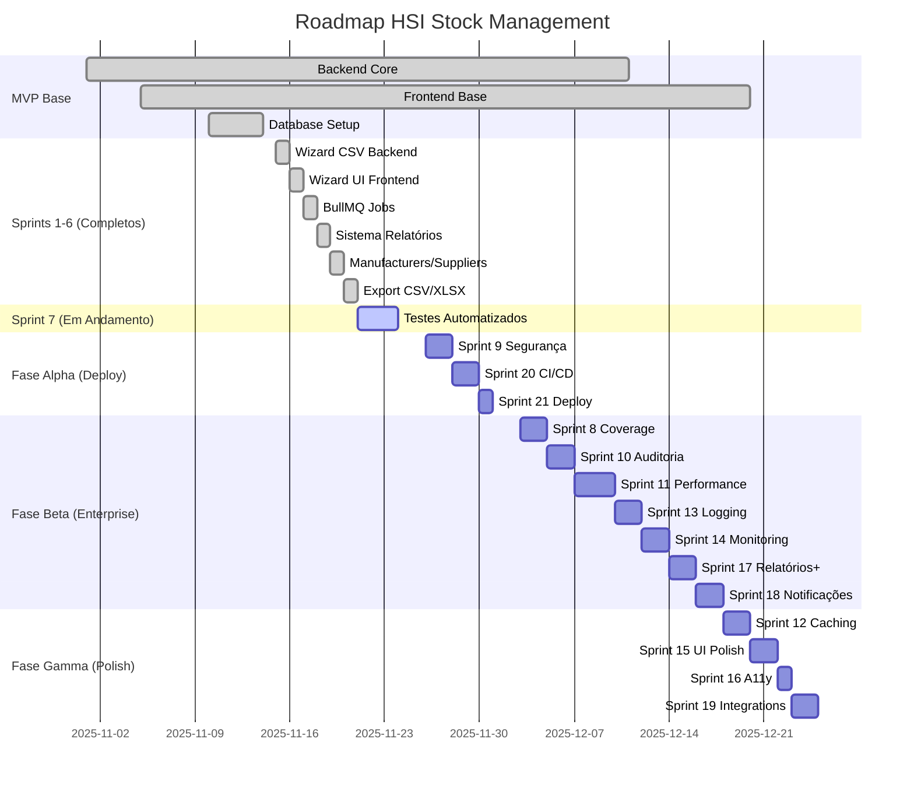

# 📊 ROADMAP VISUAL - Sistema HSI Stock Management

**Status:** MVP 100% + 6 Sprints Completas  
**Próximo Milestone:** Deploy em Produção  
**Versão:** 1.0.0

---

## 🎯 VISÃO GERAL DO PROGRESSO

```
████████████████████████████████████░░░░░░░░░░  75% COMPLETO

MVP + Sprints 1-6: ✅ 128h completas
Sprints 7-21:      ⏳ 199h planejadas
─────────────────────────────────────────────────
TOTAL:             327h (41 dias úteis)
```

---

## 📈 LINHA DO TEMPO



---

## ✅ CHECKLIST COMPLETO

### 🟢 FUNDAÇÃO (100% - 128h)

#### Backend Core ✅
- [x] NestJS estruturado com módulos
- [x] Prisma ORM + PostgreSQL
- [x] 56 endpoints REST documentados
- [x] Swagger UI completo
- [x] Autenticação JWT + RBAC
- [x] Guards e Middleware de segurança
- [x] Health checks

#### Frontend Core ✅
- [x] Next.js 14 + App Router
- [x] 17 páginas implementadas
- [x] Autenticação + proteção de rotas
- [x] Dashboard com KPIs
- [x] CRUDs completos (Assets, Categories, Locations, etc.)
- [x] Theme system (light/dark)
- [x] Componentes reutilizáveis

#### Features Completas ✅
- [x] **Sprint 1:** Wizard CSV Backend (detecção, validação)
- [x] **Sprint 2:** Wizard UI Frontend (4 passos)
- [x] **Sprint 3:** BullMQ Jobs Assíncronos
- [x] **Sprint 4:** Sistema de Relatórios (dashboard, charts)
- [x] **Sprint 5:** Manufacturers/Suppliers UI
- [x] **Sprint 6:** Export CSV/XLSX (ativos, movimentações, relatórios)

---

### 🟡 EM ANDAMENTO (25% - 5h/20h)

#### Sprint 7: Testes Automatizados
- [x] Setup Jest + TypeScript (100%)
- [x] 40 testes unitários passando (100%)
  - [x] AuthService (6 testes, 100% coverage)
  - [x] AssetsService (13 testes, 60% coverage)
  - [x] ReportsService (9 testes, 98% coverage)
  - [x] ExportService (12 testes, 99% coverage)
- [ ] Unit tests services restantes (0%)
  - [ ] CategoriesService
  - [ ] LocationsService
  - [ ] ManufacturersService
  - [ ] SuppliersService
  - [ ] LicensesService
  - [ ] MovementsService
  - [ ] ImportService (crítico)
- [ ] Integration tests (0%)
- [ ] Frontend tests (0%)

**Progresso:** █████░░░░░░░░░░░░░░░ 25%

---

### ⚪ PENDENTE - FASE ALPHA (Deploy) (0% - 56h)

#### Sprint 9: Segurança Avançada (16h)
- [ ] Two-Factor Authentication (2FA)
- [ ] Rate limiting por usuário
- [ ] JWT refresh tokens
- [ ] Security headers (Helmet)
- [ ] Secrets Management (Vault)

#### Sprint 20: CI/CD Avançado (12h)
- [ ] GitHub Actions completo
- [ ] Docker multi-stage otimizado
- [ ] Deploy automático staging
- [ ] Infrastructure as Code (Terraform)

#### Sprint 21: Deploy Production-Ready (8h)
- [ ] High Availability (Load Balancer)
- [ ] Disaster Recovery (Backup)
- [ ] SSL/TLS (Let's Encrypt)
- [ ] Domain e DNS configurado

**Meta:** Sistema pronto para produção em 7 dias úteis

---

### ⚪ PENDENTE - FASE BETA (Enterprise) (0% - 103h)

#### Qualidade
- [ ] Sprint 8: Coverage >90% + Integration Tests (15h)

#### Segurança & Compliance
- [ ] Sprint 10: Auditoria Completa + LGPD (12h)

#### Performance
- [ ] Sprint 11: Database + API Optimization (18h)

#### Observabilidade
- [ ] Sprint 13: Winston Logging + Sentry (12h)
- [ ] Sprint 14: Prometheus + Grafana (12h)

#### Features Avançadas
- [ ] Sprint 17: Relatórios Customizáveis (16h)
- [ ] Sprint 18: Notificações + Automações (12h)

**Meta:** Sistema enterprise-grade em 3 semanas

---

### ⚪ PENDENTE - FASE GAMMA (Polish) (0% - 40h)

#### Performance Avançada
- [ ] Sprint 12: Redis Caching + Read Replicas (14h)

#### UX/UI
- [ ] Sprint 15: Storybook + Micro-interactions (12h)
- [ ] Sprint 16: WCAG 2.1 AA + Mobile (8h)

#### Integrações
- [ ] Sprint 19: API Webhooks + Slack (12h)

**Meta:** Polimento final em 1 semana

---

## 🎯 MILESTONES

### Milestone 1: MVP Completo ✅
**Status:** ✅ ENTREGUE (Novembro 2025)
- Backend 100% funcional
- Frontend 100% funcional
- 3.082 registros reais importados
- Docker operacional

---

### Milestone 2: Deploy Alpha 🎯
**Target:** 3 de Dezembro de 2025
**Duração:** 7 dias úteis (56h)

**Critérios de Aceitação:**
- ✅ Sistema rodando em produção (HA)
- ✅ Testes automatizados >80% coverage
- ✅ 2FA habilitado para ADMIN
- ✅ CI/CD pipeline funcional
- ✅ SSL/TLS configurado
- ✅ Backup/restore testado

**Riscos:**
- 🟡 Tempo de configuração de infraestrutura (AWS/DO)
- 🟡 Debugging de issues em produção

---

### Milestone 3: Enterprise-Grade 🎯
**Target:** 24 de Dezembro de 2025
**Duração:** 3 semanas (103h)

**Critérios de Aceitação:**
- ✅ Coverage >90%
- ✅ Auditoria completa implementada
- ✅ Prometheus + Grafana funcionando
- ✅ Relatórios customizáveis
- ✅ Notificações automáticas
- ✅ Performance otimizada (<200ms p95)

**Riscos:**
- 🟡 Complexidade de integração (Prometheus, Sentry)
- 🟢 Features podem ser priorizadas diferentemente

---

### Milestone 4: Polished Product 🎯
**Target:** 3 de Janeiro de 2026
**Duração:** 1 semana (40h)

**Critérios de Aceitação:**
- ✅ Redis caching implementado
- ✅ Storybook com 30+ componentes
- ✅ WCAG 2.1 AA compliance
- ✅ API webhooks funcionando
- ✅ Slack integration testada

**Riscos:**
- 🟢 Baixo - features opcionais

---

## 📊 MATRIZ DE PRIORIDADES

### 🔴 CRÍTICO (Bloqueadores de Deploy)
| Sprint | Feature | Motivo | Horas |
|--------|---------|--------|-------|
| 7 | Testes Automatizados | Garantir qualidade em prod | 20h |
| 9 | Segurança Avançada | 2FA, rate limiting | 16h |
| 21 | Deploy HA + SSL | Sistema acessível publicamente | 8h |

**Total Crítico:** 44h (~6 dias)

---

### 🟡 ALTO (Enterprise-Grade)
| Sprint | Feature | Motivo | Horas |
|--------|---------|--------|-------|
| 8 | Coverage 90% | Confiança no código | 15h |
| 10 | Auditoria | Compliance LGPD | 12h |
| 11 | Performance | Escalabilidade | 18h |
| 13 | Logging | Debugging produção | 12h |
| 14 | Monitoring | Alertas proativos | 12h |
| 17 | Relatórios+ | Valor de negócio | 16h |
| 20 | CI/CD | Deploy contínuo | 12h |

**Total Alto:** 97h (~12 dias)

---

### 🟢 MÉDIO (Polish & Integrações)
| Sprint | Feature | Motivo | Horas |
|--------|---------|--------|-------|
| 12 | Caching | Performance adicional | 14h |
| 15 | UI Polish | UX melhorada | 12h |
| 16 | Acessibilidade | Inclusão | 8h |
| 18 | Notificações | Automação | 12h |
| 19 | Webhooks | Integrações | 12h |

**Total Médio:** 58h (~7 dias)

---

## 🚀 ESTRATÉGIA DE EXECUÇÃO

### Semana 1-2 (Deploy Alpha)
```
Segunda: Sprint 7 (completar) - 8h
Terça:   Sprint 7 (finalizar) + Sprint 9 (iniciar) - 8h  
Quarta:  Sprint 9 (2FA, rate limiting) - 8h
Quinta:  Sprint 20 (CI/CD setup) - 8h
Sexta:   Sprint 20 (Terraform) + Sprint 21 (iniciar) - 8h
Segunda: Sprint 21 (Deploy HA, SSL) - 8h
Terça:   Testes em produção, ajustes - 8h

✅ RESULTADO: Sistema em produção
```

### Semana 3-5 (Enterprise-Grade)
```
Distribuir sprints 8, 10, 11, 13, 14, 17, 18 ao longo de 3 semanas
Priorizar: 8 → 10 → 11 → 13 → 14 → 17 → 18

✅ RESULTADO: Sistema enterprise completo
```

### Semana 6 (Polish Final)
```
Sprints 12, 15, 16, 19 em paralelo ou sequencial

✅ RESULTADO: Sistema polido e integrável
```

---

## 📈 TRACKING DE PROGRESSO

### Burndown Chart (Conceitual)

```
Horas
│
327h ├─────────┐
     │         │
256h │         └──────┐ ← MVP + Sprints 1-6
     │                │
199h │                ├──────┐ ← Sprint 7 (atual)
     │                │      │
143h │                │      └────┐ ← Fase Alpha
     │                │           │
 40h │                │           └──────┐ ← Fase Beta
     │                │                  │
  0h └────────────────────────────────────┘ ← Fase Gamma
     Nov  Nov  Dez  Dez  Dez  Jan
     15   26   03   24   31   03
```

### Velocity Estimada

**Atual:** ~20h/semana (2.5 dias/semana)  
**Meta:** 40h/semana (5 dias/semana tempo integral)

**Com 40h/semana:**
- Fase Alpha: 1.5 semanas
- Fase Beta: 2.5 semanas
- Fase Gamma: 1 semana
- **Total:** 5 semanas (~25 dias úteis)

---

## 🎯 DEFINIÇÃO DE PRONTO (DoD)

### Para Cada Sprint

**Código:**
- ✅ Zero erros TypeScript
- ✅ Build passando (Turbo)
- ✅ Testes escritos e passando
- ✅ Coverage >80% (código novo)

**Qualidade:**
- ✅ Code review aprovado
- ✅ Sem TODOs ou FIXMEs críticos
- ✅ Performance testada

**Documentação:**
- ✅ README atualizado (se aplicável)
- ✅ Swagger atualizado (se novos endpoints)
- ✅ Comentários em lógica complexa

**Deploy:**
- ✅ Merge em `main`
- ✅ Deploy em staging testado
- ✅ Changelog atualizado

---

### Para Cada Fase

**Fase Alpha (Deploy):**
- ✅ Sistema acessível via HTTPS
- ✅ Health checks respondendo
- ✅ Backup configurado
- ✅ Documentação de runbook

**Fase Beta (Enterprise):**
- ✅ Dashboards Grafana configurados
- ✅ Alertas funcionando
- ✅ Logs centralizados
- ✅ Coverage >90%

**Fase Gamma (Polish):**
- ✅ Lighthouse score >90
- ✅ WCAG 2.1 AA compliance
- ✅ Storybook publicado
- ✅ API public docs publicada

---

## 🔄 PROCESSO DE REVISÃO

### Weekly Sprint Review

**Quando:** Toda sexta-feira, 16h  
**Duração:** 1 hora  
**Participantes:** Time dev + stakeholders

**Agenda:**
1. Demo das features completadas (15min)
2. Review de métricas (10min):
   - Velocity (horas completadas vs. planejadas)
   - Coverage (% atual)
   - Performance (p95 API)
   - Bugs abertos vs. fechados
3. Retrospectiva (15min):
   - O que funcionou bem?
   - O que pode melhorar?
   - Bloqueadores?
4. Planejamento próxima sprint (20min)

---

### Monthly Stakeholder Update

**Quando:** Última sexta de cada mês  
**Formato:** Apresentação executiva (slides)

**Conteúdo:**
- Status dos milestones
- Features entregues vs. planejadas
- Riscos e mitigações
- ROI e métricas de negócio

---

## 📞 CONTATOS E RESPONSABILIDADES

### Roles

**Product Owner:** [Nome]  
- Priorização de features  
- Aprovação de releases  

**Tech Lead:** [Nome]  
- Arquitetura e decisões técnicas  
- Code reviews  

**DevOps:** [Nome]  
- Infraestrutura  
- CI/CD  
- Monitoramento  

**QA:** [Nome]  
- Testes manuais  
- Automação de testes E2E  

---

## 🏁 CONCLUSÃO

### Onde Estamos
✅ MVP 100% completo  
✅ 6 sprints entregues (128h)  
✅ Sistema funcional em Docker  
🟡 Sprint 7 iniciado (25% completo)  

### Para Onde Vamos
🎯 **Curto Prazo (2 semanas):** Deploy em produção (Fase Alpha)  
🎯 **Médio Prazo (1 mês):** Sistema enterprise-grade (Fase Beta)  
🎯 **Longo Prazo (1.5 meses):** Produto polido e integrável (Fase Gamma)  

### Como Chegamos Lá
📋 **15 sprints planejadas** (199h)  
📊 **Priorização clara** (Crítico → Alto → Médio)  
🔄 **Processo iterativo** (Review semanal)  
📈 **Métricas mensuráveis** (Coverage, Performance, Uptime)  

---

**Este sistema está sendo transformado de MVP para solução enterprise através de um roadmap bem definido, mensurável e executável.**

**Próxima ação:** Finalizar Sprint 7 (Testes Automatizados) - 15h restantes

---

*Documento mantido por: Time de Desenvolvimento HSI Stock*  
*Última atualização: 26 de Novembro de 2025*  
*Versão: 1.0.0*
