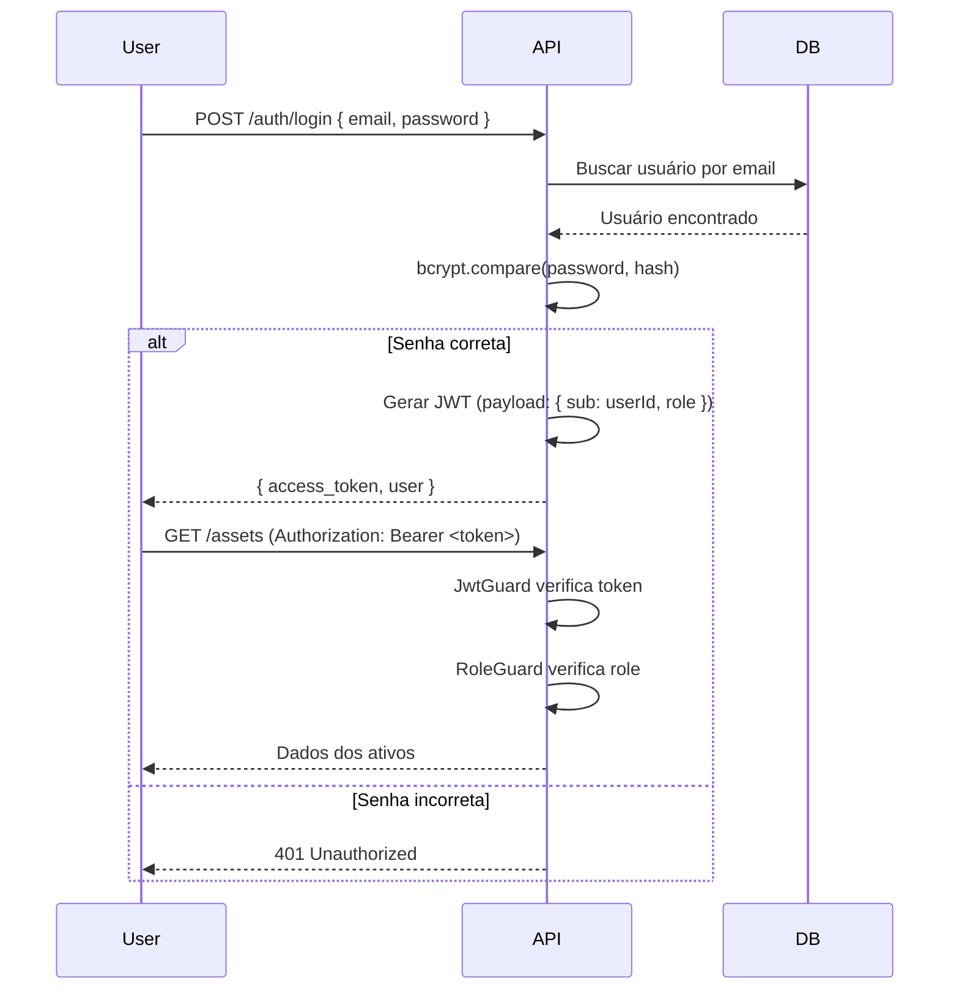

# ADR 001: Autenticação e Autorização (RBAC)

**Status:** Aceito  
**Data:** 2025-11-11  
**Decisores:** Arquitetura de Software

## Contexto

O sistema precisa de autenticação segura e controle de acesso baseado em papéis (RBAC) para garantir que:
- Diferentes níveis de usuários tenham acesso apropriado
- Auditoria completa de ações seja possível
- Segurança seja garantida (senhas, tokens, sessões)

## Decisão

### Autenticação: JWT (JSON Web Tokens)

**Escolhido:** JWT com Bearer tokens

**Alternativas consideradas:**
1. **Sessions com cookies:** Stateful, requer armazenamento servidor
2. **OAuth 2.0 / OIDC:** Overkill para sistema interno, mas preparado para futuro
3. **API Keys:** Menos seguro, sem expiração automática

**Justificativa JWT:**
- ✅ Stateless: API não precisa armazenar sessões
- ✅ Escalável: Múltiplas instâncias da API sem estado compartilhado
- ✅ Padrão indústria: Amplamente suportado
- ✅ Payload customizável: userId, role, email no token
- ✅ Expiração automática: Tokens expiram (7 dias padrão)

### Autorização: RBAC (Role-Based Access Control)

**Papéis definidos:**

| Papel | Permissões |
|-------|-----------|
| **ADMIN** | Acesso total: CRUD em todas entidades, configurações, usuários |
| **GESTOR** | Gerencia ativos, licenças, aprova importações, relatórios |
| **TECNICO** | Movimenta ativos, cria manutenções, importa dados, visualiza relatórios |
| **LEITOR** | Somente leitura: visualiza ativos, licenças, relatórios |

**Implementação:**
- Campo `role` na tabela `users` (enum)
- Guards no NestJS verificam role antes de executar endpoint
- Decorator `@Roles('ADMIN', 'GESTOR')` nos controllers

### Hashing de Senhas: bcrypt

**Escolhido:** bcrypt com salt rounds = 10

**Alternativas:**
1. **argon2:** Mais moderno, mas bcrypt é padrão estabelecido
2. **SHA-256 + salt manual:** Menos seguro, mais trabalho

**Justificativa:**
- ✅ Indústria standard
- ✅ Resistente a rainbow tables (salt automático)
- ✅ Configurável (cost factor)
- ✅ Amplamente testado e auditado

### Fluxo de Autenticação

## Consequências

### Positivas
- ✅ Segurança robusta
- ✅ Sem state no servidor (escalável)
- ✅ Auditoria fácil (userId no token)
- ✅ Fácil adicionar SSO futuramente (OAuth 2.0 / SAML)

### Negativas
- ⚠️ Token não pode ser "revogado" instantaneamente (precisa expirar)
- ⚠️ Refresh tokens não implementados na v1 (mas JWT expira em 7 dias)

## Mitigações

- **Revogação:** Implementar blacklist de tokens em Redis (futuro)
- **Refresh tokens:** Implementar endpoint `/auth/refresh` (futuro)
- **2FA:** Adicionar autenticação de dois fatores (futuro)
- **SSO:** Preparar integração com Azure AD / Google Workspace (futuro)

## Implementação

### Backend (NestJS)

**Estratégia JWT:**
\`\`\`typescript
// jwt.strategy.ts
@Injectable()
export class JwtStrategy extends PassportStrategy(Strategy) {
  constructor() {
    super({
      jwtFromRequest: ExtractJwt.fromAuthHeaderAsBearerToken(),
      secretOrKey: process.env.JWT_SECRET,
    });
  }

  async validate(payload: any) {
    return { userId: payload.sub, email: payload.email, role: payload.role };
  }
}
\`\`\`

**Guard de Role:**
\`\`\`typescript
// roles.guard.ts
@Injectable()
export class RolesGuard implements CanActivate {
  canActivate(context: ExecutionContext): boolean {
    const requiredRoles = this.reflector.get<UserRole[]>('roles', context.getHandler());
    const { user } = context.switchToHttp().getRequest();
    return requiredRoles.some((role) => user.role === role);
  }
}
\`\`\`

**Uso em Controller:**
\`\`\`typescript
@Controller('assets')
@UseGuards(JwtAuthGuard, RolesGuard)
export class AssetsController {
  @Get()
  @Roles('ADMIN', 'GESTOR', 'TECNICO', 'LEITOR')
  findAll() { ... }

  @Post()
  @Roles('ADMIN', 'GESTOR', 'TECNICO')
  create() { ... }

  @Delete(':id')
  @Roles('ADMIN')
  remove() { ... }
}
\`\`\`

### Frontend (Next.js)

**Context de Autenticação:**
\`\`\`typescript
// useAuth.ts
export function useAuth() {
  const [user, setUser] = useState(null);
  
  const login = async (email, password) => {
    const res = await api.post('/auth/login', { email, password });
    localStorage.setItem('token', res.data.access_token);
    setUser(res.data.user);
  };

  const logout = () => {
    localStorage.removeItem('token');
    setUser(null);
  };

  return { user, login, logout };
}
\`\`\`

**Proteção de Rotas:**
\`\`\`typescript
// middleware.ts
export function middleware(request: NextRequest) {
  const token = request.cookies.get('token');
  if (!token) {
    return NextResponse.redirect(new URL('/login', request.url));
  }
}
\`\`\`

---

**Decisão final:** JWT + RBAC com 4 papéis (Admin, Gestor, Técnico, Leitor) e bcrypt para senhas.
