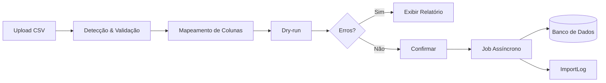

# ADR 002: Importação de CSV com Wizard e Jobs Assíncronos

**Status:** Aceito  
**Data:** 2025-11-11  
**Decisores:** Arquitetura de Software

## Contexto

O sistema precisa importar grandes volumes de dados de CSVs (potencialmente 100k+ linhas) de forma:
- **Segura:** Validação antes de persistir
- **Confiável:** Detecção automática de formato, tratamento de erros
- **Auditável:** Log de todas as importações
- **Escalável:** Não bloquear a API em importações grandes
- **Usável:** Interface intuitiva para usuários não técnicos

## Decisão

### Arquitetura de 3 Camadas

### Componentes

#### 1. Detecção Automática

**Biblioteca:** `csv-parse` (Node.js)

**Detecta:**
- Separador (`,`, `;`, `\t`) via heurística (contagem de ocorrências)
- Encoding (`UTF-8`, `latin1`) via `chardet`
- Cabeçalhos (primeira linha)
- Amostra de 100 linhas para preview

**Exemplo:**
\`\`\`typescript
async detectFormat(filePath: string) {
  const encoding = chardet.detectFileSync(filePath);
  const sample = fs.readFileSync(filePath, { encoding });
  
  // Detectar separador
  const delimiters = [',', ';', '\t'];
  const counts = delimiters.map(d => sample.split(d).length);
  const delimiter = delimiters[counts.indexOf(Math.max(...counts))];
  
  // Parse amostra
  const records = parse(sample, { delimiter, to_line: 100 });
  
  return { encoding, delimiter, headers: records[0], sample: records };
}
\`\`\`

#### 2. Mapeamento de Colunas

**Estratégia:**
1. **Automático:** Match por similaridade de string (Levenshtein distance)
2. **Manual:** Usuário ajusta mapeamentos incorretos
3. **Templates:** YAML pré-configurados em `/data/mappings/`

**Exemplo de Template YAML:**
\`\`\`yaml
column_mappings:
  "Item": "name"
  "Serial Number/Service Tag": "serial_number"
  "Patrimônio": "asset_tag"
  "Quantidade": "quantity"

validations:
  - field: "name"
    required: true
    type: "string"
  - field: "quantity"
    required: true
    type: "integer"
    min: 0

transformations:
  - field: "serial_number"
    transform: "normalize_empty"
    null_values: ["N/A", "n/a", ""]
\`\`\`

#### 3. Validação & Dry-run

**Validações aplicadas:**
- Tipos de dados (string, integer, date, decimal)
- Obrigatoriedade (campos required)
- Ranges (min/max para números)
- Formatos (datas, emails, CNPJs)
- Unicidade (asset_tag, email)
- Referências (categorias, localizações existentes)

**Dry-run:** Simula inserção sem commit ao banco, retorna relatório:
\`\`\`json
{
  "total_rows": 1500,
  "valid_rows": 1450,
  "invalid_rows": 50,
  "errors": [
    {
      "line": 42,
      "field": "quantity",
      "error": "Must be a positive integer",
      "value": "-5"
    }
  ],
  "warnings": [
    {
      "line": 100,
      "field": "category",
      "warning": "Category 'Notebooks' not found, will create"
    }
  ]
}
\`\`\`

#### 4. Jobs Assíncronos com BullMQ

**Por quê BullMQ?**
- ✅ Baseado em Redis (rápido, persistente)
- ✅ Retry automático em caso de falha
- ✅ Progress tracking (% concluído)
- ✅ Concorrência configurável
- ✅ UI de admin (Bull Board)

**Fluxo:**
\`\`\`typescript
// Producer (API)
async createImportJob(userId: string, filePath: string, mapping: Mapping) {
  const job = await importQueue.add('import-csv', {
    userId,
    filePath,
    mapping,
  });
  
  await prisma.importLog.create({
    data: {
      filename: path.basename(filePath),
      status: 'PENDING',
      userId,
    },
  });
  
  return job.id;
}

// Consumer (Worker)
importQueue.process('import-csv', async (job) => {
  const { filePath, mapping } = job.data;
  
  const records = await parseCSV(filePath, mapping);
  
  for (const [index, record] of records.entries()) {
    await prisma.asset.create({ data: record });
    await job.updateProgress((index / records.length) * 100);
  }
  
  await prisma.importLog.update({
    where: { id: job.data.importLogId },
    data: { status: 'COMPLETED', successRows: records.length },
  });
});
\`\`\`

### Decisões Técnicas

| Aspecto | Decisão | Alternativa | Justificativa |
|---------|---------|-------------|---------------|
| **Parser CSV** | csv-parse | papaparse | Streaming, performance em arquivos grandes |
| **Queue** | BullMQ | RabbitMQ, SQS | Simplicidade, Redis já usado, bom para volumes médios |
| **Encoding** | chardet | manual | Detecção automática, menos erros de usuário |
| **Validação** | class-validator | Zod | Decorators no NestJS, integração nativa |
| **Mapeamento** | YAML templates | UI-only | Versionável, reusável, GitOps |

## Wizard UI (3 Passos)

### Passo 1: Upload e Detecção
- Drag & drop ou file picker
- Exibe preview (10 primeiras linhas)
- Mostra encoding e separador detectados

### Passo 2: Mapeamento
- Dropdown para cada coluna CSV → campo do sistema
- Sugestões automáticas (highlight em verde se confiança > 80%)
- Opção de salvar mapeamento como template

### Passo 3: Validação e Commit
- Botão "Validar" → executa dry-run
- Exibe tabela de erros/warnings
- Botão "Importar" (desabilitado se erros críticos)
- Progresso em tempo real via WebSocket ou polling

## Auditoria

Tabela `ImportLog` registra:
- Quem importou (userId)
- Quando (startedAt, completedAt)
- Arquivo (filename, originalName)
- Status (PENDING, PROCESSING, COMPLETED, FAILED)
- Contadores (totalRows, successRows, errorRows)
- Erros (JSON com detalhes)

## Performance

### Otimizações:
- **Streaming:** Processar CSV em chunks, não carregar tudo em memória
- **Batch inserts:** Usar `createMany()` do Prisma
- **Transações:** Rollback em caso de erro crítico
- **Índices:** asset_tag, serialNumber indexados
- **Workers:** Múltiplos workers consumindo da fila

### Benchmarks esperados:
- **10k linhas:** ~30 segundos
- **100k linhas:** ~5 minutos (com 3 workers)

## Consequências

### Positivas
- ✅ UX excelente (wizard guiado)
- ✅ Confiabilidade (validação + dry-run)
- ✅ Escalabilidade (jobs assíncronos)
- ✅ Auditoria completa

### Negativas
- ⚠️ Complexidade adicional (Redis, BullMQ)
- ⚠️ Requer Redis em produção

## Mitigações

- **Fallback:** Se Redis indisponível, processar síncrono (com timeout)
- **Monitoria:** Bull Board para visualizar filas
- **Retry:** Configurar 3 tentativas com backoff exponencial

---

**Decisão final:** Wizard em 3 passos com detecção automática, validação via dry-run e processamento assíncrono via BullMQ/Redis.
