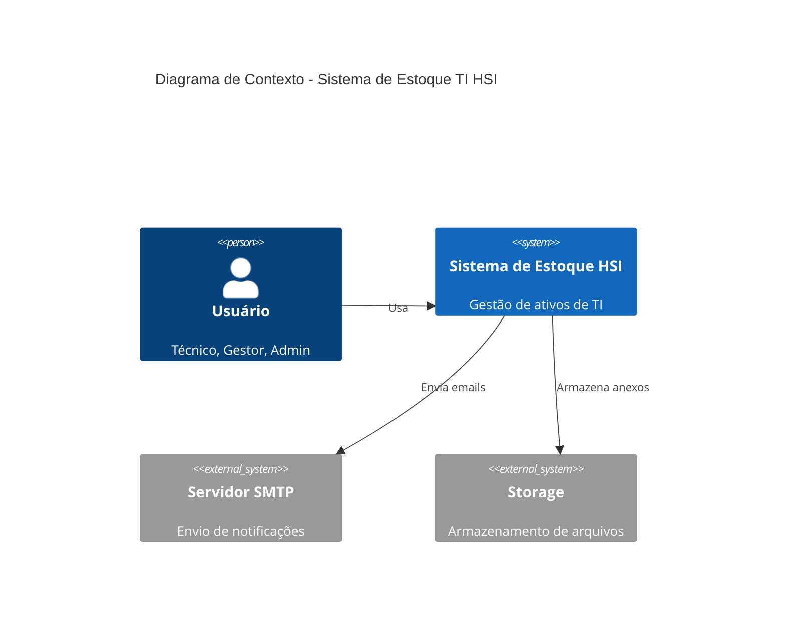
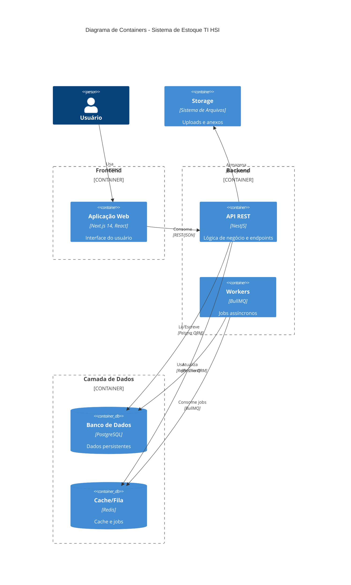
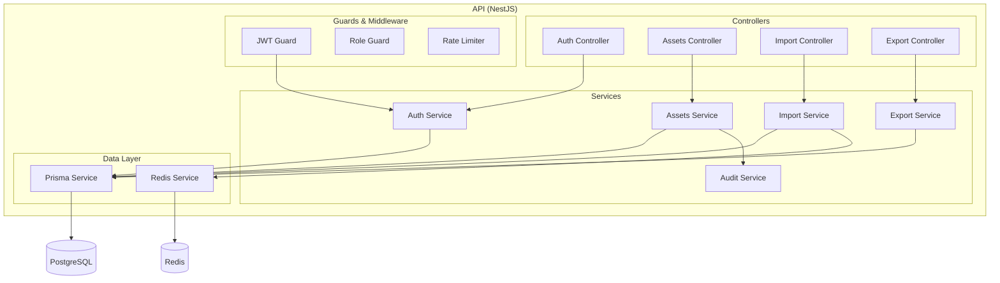
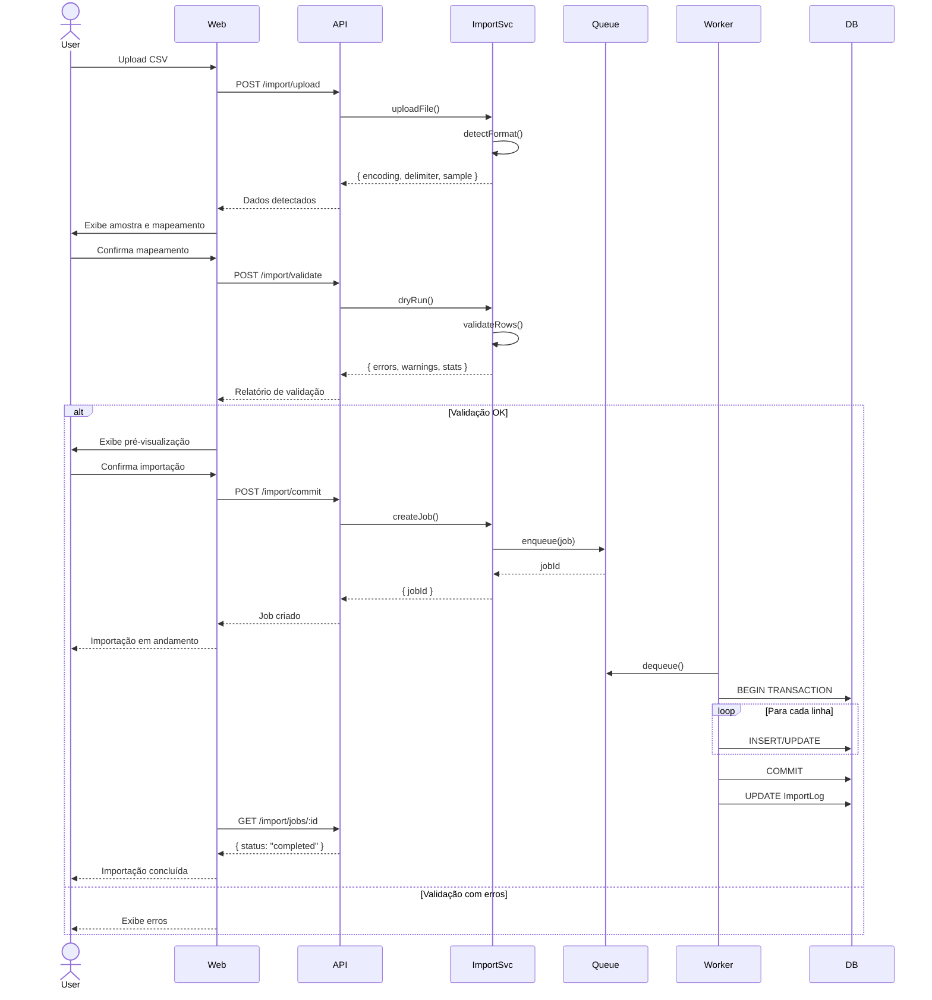
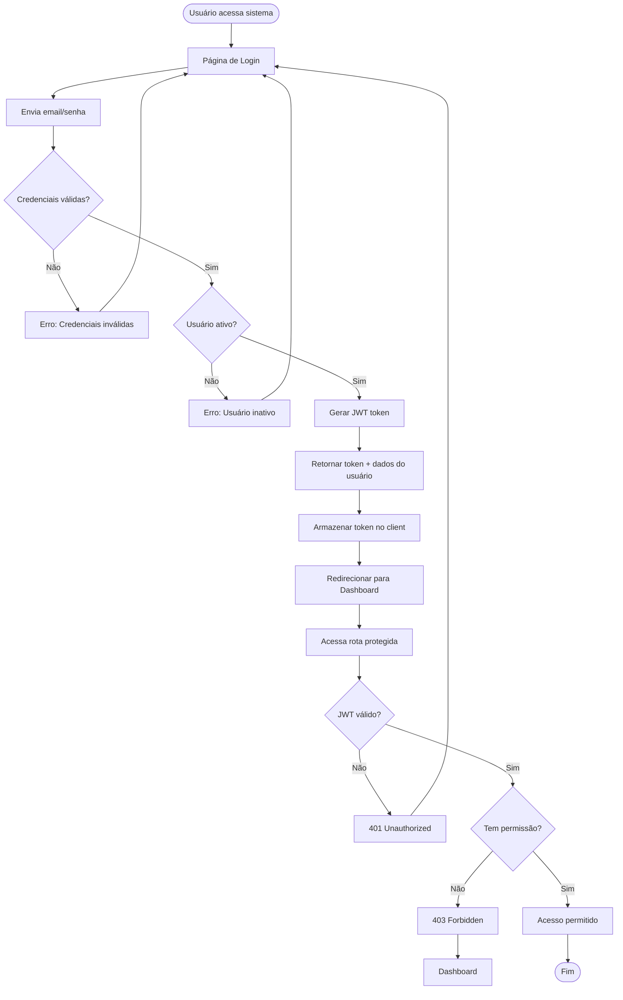

# Arquitetura do Sistema

## Visão Geral

O Sistema de Estoque TI HSI é uma aplicação monorepo TypeScript full-stack organizada em camadas bem definidas.

## Diagrama de Alto Nível



## Diagrama de Containers



## Diagrama de Componentes (Backend)



## Diagrama de Sequência (Importação CSV)



## Diagrama de Fluxo (Autenticação)



## Padrões Arquiteturais

### 1. Monorepo (Turborepo)
- **Workspaces:** `apps/api`, `apps/web`, `packages/db`, `packages/shared`
- **Cache compartilhado:** Builds incrementais
- **Dependências comuns:** Tipagem compartilhada

### 2. Camadas (Layered Architecture)
- **Presentation:** Next.js (SSR/CSR)
- **Application:** NestJS Controllers
- **Domain:** Services e lógica de negócio
- **Infrastructure:** Prisma, Redis, File System

### 3. Dependency Injection (NestJS)
- **Modules:** Organização modular
- **Providers:** Services injetáveis
- **Guards:** Autenticação e autorização

### 4. Repository Pattern (Prisma)
- **Abstração de dados:** Prisma Client
- **Migrations:** Versionadas e declarativas
- **Type-safety:** Geração automática de tipos

### 5. Queue Pattern (Jobs Assíncronos)
- **Producer:** API enfileira jobs
- **Consumer:** Workers processam em background
- **Retry:** Tentativas automáticas em caso de falha

## Fluxo de Dados

### Leitura (Query)
```
User → Web (Next.js) → API (NestJS) → Prisma → PostgreSQL
                                              ↓
                                         Cache (Redis)
```

### Escrita (Mutation)
```
User → Web → API → Prisma → PostgreSQL
                     ↓
                  AuditLog (registra mudança)
```

### Importação (Assíncrona)
```
User → Web → API → Queue (Redis/BullMQ)
                     ↓
                  Worker → Prisma → PostgreSQL
                            ↓
                        ImportLog (progresso)
```

## Segurança

- **Autenticação:** JWT Bearer tokens
- **Autorização:** RBAC (Guards baseados em role)
- **Senhas:** bcrypt (hash + salt)
- **Rate Limiting:** Throttler (60 req/min)
- **Headers:** Helmet (CSP, XSS, etc.)
- **Validação:** class-validator + DTOs
- **CORS:** Whitelist de origins

## Observabilidade

- **Logs:** Estruturados (JSON) com contexto
- **Health Check:** `/health` endpoint
- **Metrics:** `/health/metrics` (contadores básicos)
- **Auditoria:** Tabela `AuditLog` com todas as operações

## Escalabilidade

### Horizontal
- **API:** Stateless, pode rodar N instâncias atrás de load balancer
- **Workers:** Múltiplos workers consumindo da mesma fila Redis

### Vertical
- **PostgreSQL:** Otimização de índices, particionamento
- **Redis:** Clustering para alta disponibilidade

### Caching
- **Redis:** Cache de queries frequentes
- **Next.js:** Static Generation + ISR
