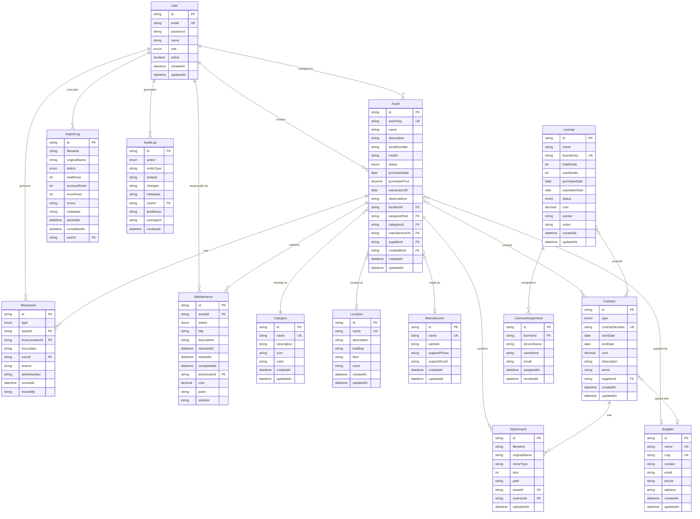

# Diagrama de Entidade-Relacionamento (ERD)

## Enums

### UserRole
- `ADMIN`: Acesso total ao sistema
- `GESTOR`: Gerencia ativos, aprovações
- `TECNICO`: Operações técnicas, manutenções
- `LEITOR`: Somente leitura

### AssetStatus
- `EM_ESTOQUE`: Disponível no estoque
- `EM_USO`: Atribuído e em uso
- `EM_MANUTENCAO`: Em manutenção/reparo
- `INATIVO`: Desativado/obsoleto
- `DESCARTADO`: Descartado

### LicenseStatus
- `ATIVA`: Licença ativa
- `EXPIRADA`: Licença expirada
- `CANCELADA`: Licença cancelada

### ContractType
- `GARANTIA`: Contrato de garantia
- `MANUTENCAO`: Contrato de manutenção
- `SUPORTE`: Contrato de suporte técnico
- `LOCACAO`: Contrato de locação

### MovementType
- `CHECK_IN`: Entrada no estoque
- `CHECK_OUT`: Saída do estoque
- `TRANSFER`: Transferência entre locais
- `ASSIGNMENT`: Atribuição a usuário
- `RETURN`: Devolução

### MaintenanceStatus
- `ABERTA`: Manutenção aberta
- `EM_ANDAMENTO`: Em andamento
- `AGUARDANDO_PECA`: Aguardando peça
- `CONCLUIDA`: Concluída
- `CANCELADA`: Cancelada

### ImportStatus
- `PENDING`: Pendente
- `PROCESSING`: Processando
- `COMPLETED`: Concluído
- `FAILED`: Falhou

### AuditAction
- `CREATE`: Criação
- `UPDATE`: Atualização
- `DELETE`: Exclusão
- `LOGIN`: Login
- `LOGOUT`: Logout
- `IMPORT`: Importação
- `EXPORT`: Exportação

## Índices

Os seguintes índices são criados para otimizar queries:

- `Asset`: `assetTag`, `serialNumber`, `status`, `categoryId`, `locationId`
- `License`: `expirationDate`
- `Contract`: `endDate`
- `Movement`: `assetId`, `movedAt`
- `Maintenance`: `assetId`, `status`
- `Attachment`: `assetId`
- `ImportLog`: `status`, `startedAt`
- `AuditLog`: `(entityType, entityId)`, `userId`, `createdAt`
